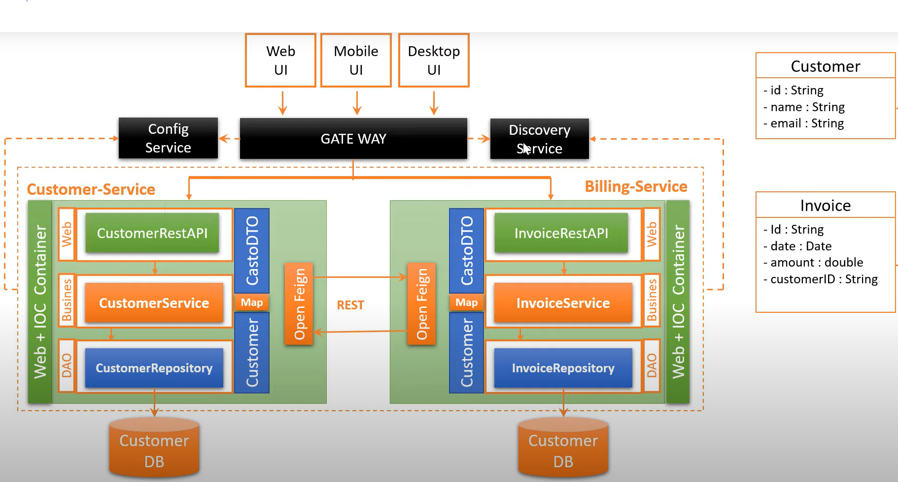

### VERSION 1.0.0-SNAPSHOT
- Développeurs : Redha CHAOU

- Architectures Micro-Services - Use case - Eureka Discovery
    - Mettre en place le Discovery Service Netflix Eureka Service

# Modules :

- [rcfactory-billing-service](git@github.com:chaouredha/rcfactory-billing-service.git)
- [rcfactory-customer-service](git@github.com:chaouredha/rcfactory-customer-service.git)
- [rcfactory-eureka-service](git@github.com:chaouredha/rcfactory-eureka-service.git)
- [rcfactory-gateway](git@github.com:chaouredha/rcfactory-gateway.git)

- Architectures :

